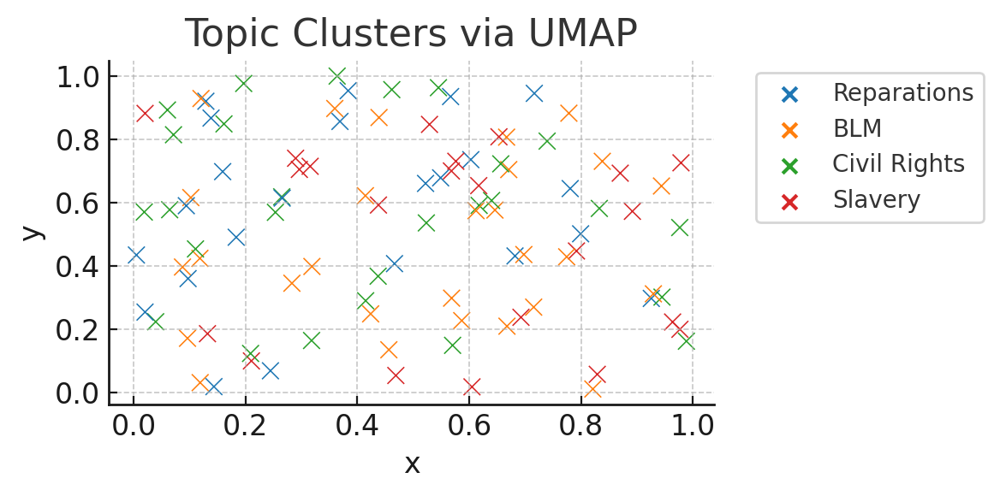
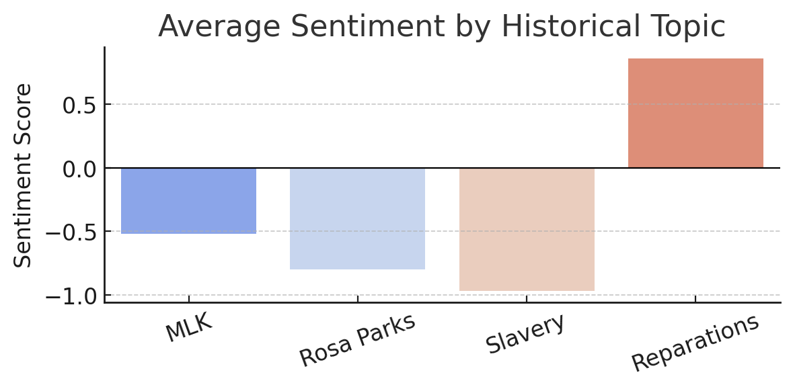

# 🔍 Historical Narratives in Social Media: Twitter Analysis Project


A comprehensive data science pipeline analyzing **Black history and civil rights narratives** on Twitter using advanced NLP techniques. This project examines how historical references shape contemporary social movements and collective action discourse.

---

## 🧠 Research Collaboration

This project was developed in coordination with renowned researchers from NYU Steinhardt's **Intergroup Conflict and Social Change Lab**:

<table>
  <tr>
    <td width="70%"><b>Dr. Rezarta Bilali</b><br>Associate Professor of Psychology and Social Intervention at NYU Steinhardt<br><br>Dr. Bilali's research focuses on social psychological factors underlying mass violence, historical narratives in collective action, and media interventions for intergroup reconciliation.</td>
    <td width="30%" align="center">📚 50+ peer-reviewed publications<br>🌍 Research in 7+ countries<br>🔬 15+ years in the field</td>
  </tr>
  <tr>
    <td width="70%"><b>Micaela Varela</b><br>PhD Student in Psychology and Social Intervention at NYU Steinhardt<br><br>Micaela studies intergroup relations and conflicts using an intersection of social, political, and community psychology, with a focus on collective action movements.</td>
    <td width="30%" align="center">🔍 Expertise in historical narratives<br>🌎 Research in Chile, Burkina Faso, and US<br>🔬 Background in Social Psychology</td>
  </tr>
</table>

Their expertise has been instrumental in developing the methodology and interpreting the findings of this project.

---

## 📊 What This System Does

- **Extracts historical references** from a large corpus of tweets
- **Identifies patterns** in how users discuss civil rights topics
- **Clusters related discussions** using state-of-the-art NLP techniques
- **Visualizes sentiment trends** across historical themes over time
- **Maps connections** between historical narratives and contemporary movements

---

## 🔬 Analysis Pipeline

<table>
  <tr>
    <td align="center"><strong>Stage 1: Data Processing</strong></td>
    <td align="center"><strong>Stage 2: NLP Analysis</strong></td>
    <td align="center"><strong>Stage 3: Results & Insights</strong></td>
  </tr>
  <tr>
    <td>
      <ul>
        <li>Raw Tweet Cleaning</li>
        <li>Thread Detection & Stitching</li>
        <li>Keyword Extraction</li>
        <li>Exclusion Filtering</li>
        <li>Text Normalization</li>
      </ul>
    </td>
    <td>
      <ul>
        <li>BERT Embeddings</li>
        <li>Dimensionality Reduction</li>
        <li>HDBSCAN Clustering</li>
        <li>Topic Modeling</li>
        <li>Sentiment Analysis</li>
      </ul>
    </td>
    <td>
      <ul>
        <li>Temporal Pattern Analysis</li>
        <li>Topic Distribution</li>
        <li>Sentiment Visualization</li>
        <li>Keyword Network Mapping</li>
        <li>Narrative Analysis</li>
      </ul>
    </td>
  </tr>
</table>

---

## 📚 Notebook Summaries

### 📘 `01_cleaning_and_extraction.ipynb`

**Goal**: Clean, structure, and filter raw Twitter data for downstream analysis.

| ⚙️ Process Step | 🔍 Description |
|----------------|---------------|
| **Raw Data Ingestion** | Load tweet data, remove duplicates and noise |
| **Thread Detection** | Identify and combine tweets from same user within 1 minute |
| **Keyword Extraction** | Apply regex pattern matching with curated historical keywords |
| **Exclusion Filtering** | Remove irrelevant keyword matches with context-aware rules |
| **Text Cleaning** | Remove links, punctuation, stopwords; normalize text |
| **Dataset Partitioning** | Create filtered subsets for different analysis purposes |

### 📗 `02_bert_topic_modeling.ipynb`

**Goal**: Identify themes and clusters in the cleaned historical tweets using BERT embeddings.

| ⚙️ Process Step | 🔍 Description |
|----------------|---------------|
| **Data Sampling** | Sample ~40% of tweets for computational efficiency |
| **BERT Embeddings** | Generate dense vector representations of each tweet |
| **Dimensionality Reduction** | Apply UMAP to reduce embedding dimensions |
| **Clustering** | Use HDBSCAN to detect natural topic clusters |
| **Topic Labeling** | Apply multiple techniques to name detected topics |
| **Topic Distribution** | Analyze frequency and relationships between topics |

### 📕 `03_visualization.ipynb`

**Goal**: Visualize historical patterns, tweet distributions, and keyword trends over time.

| ⚙️ Process Step | 🔍 Description |
|----------------|---------------|
| **Descriptive Stats** | Calculate tweet counts, keyword frequencies |
| **Timeline Plots** | Track historical tweets and keyword usage over time |
| **Sentiment Analysis** | Measure emotional valence in historical discussions |
| **Trend Analysis** | Identify spikes in historical references |
| **Keyword Relationships** | Map connections between historical terms |

---

## 📂 Project Structure

```
project-root/
├── 📁 notebooks/
│   ├── 01_cleaning_and_extraction.ipynb
│   ├── 02_bert_topic_modeling.ipynb
│   ├── 03_visualization.ipynb
│
├── 📁 data/
│   ├── raw/
│   │   ├── data.csv                           # 5% of original tweet dataset
│   │   ├── historical_keywords.csv            # Keywords to extract
│   │   ├── historical_keywords_exclusions.csv # Terms to filter out
│   │
│   ├── processed/
│   │   ├── extended_cleaned_tweets.xlsx       # All cleaned tweets
│   │   ├── simplified_cleaned_tweets.xlsx     # Streamlined version
│   │   ├── sentiment_labeled_tweets.xlsx      # With sentiment scores
│   │
│   ├── reports/
│       ├── average_sentiment_per_keyword.xlsx # Sentiment analysis
│       ├── descriptives.xlsx                  # Summary statistics
│       └── keyword_series.xlsx                # Keyword frequencies
│
├── README.md
├── requirements.txt
└── LICENSE
```

---

## 🔑 Key Research Insights

This pipeline reveals patterns in how historical references shape contemporary social discourse:

- **Temporal Patterns**: Historical references spike around commemorative dates and in response to current events
- **Narrative Framing**: Different historical figures and events are invoked to legitimize modern movements
- **Sentiment Variation**: Distinct emotional tones when discussing different historical references
- **Topical Clustering**: Clear groupings of historical references that tend to co-occur
- **Narrative Evolution**: Changes in how historical references are deployed over time

---

## 🚀 Getting Started

### Prerequisites
- Python 3.8+
- Pandas, NumPy, Matplotlib
- BERT, Transformers
- UMAP, HDBSCAN

### Installation

```bash
# Clone repository
git clone https://github.com/yourusername/historical-twitter-analysis.git
cd historical-twitter-analysis

# Create virtual environment
python -m venv venv
source venv/bin/activate  # On Windows: venv\Scripts\activate

# Install dependencies
pip install -r requirements.txt
```

### Usage

```bash
# 1. Run cleaning and preprocessing
jupyter notebook notebooks/01_cleaning_and_extraction.ipynb

# 2. Perform topic modeling
jupyter notebook notebooks/02_bert_topic_modeling.ipynb

# 3. Generate visualizations
jupyter notebook notebooks/03_visualization.ipynb
```

---


## 📊 Sample Visualizations

#### Historical References Over Time


#### Topic Clusters Visualization


#### Keyword Co-occurrence Network


#### Sentiment Analysis by Topic


---

## 🔄 Future Work

- [ ] Extend analysis to additional social media platforms
- [ ] Incorporate image analysis for memes and visual historical references
- [ ] Develop predictive models for historical reference deployment
- [ ] Create interactive dashboard for real-time monitoring
- [ ] Expand keyword set to include international historical references

---

## 📚 Citation

If you use this analysis or methodology in your research, please cite:

```
@misc{historical_twitter_analysis,
  author = {Your Name and Bilali, Rezarta and Varela, Micaela},
  title = {Historical Narratives in Social Media: Twitter Analysis Project},
  year = {2025},
  publisher = {GitHub},
  url = {https://github.com/yourusername/repo-name}
}
```

---

## 📜 License

This project is licensed under the MIT License - see the LICENSE file for details.

---

<p align="center">
  <i>This project contributes to our understanding of how collective memory shapes contemporary social movements</i>
</p>